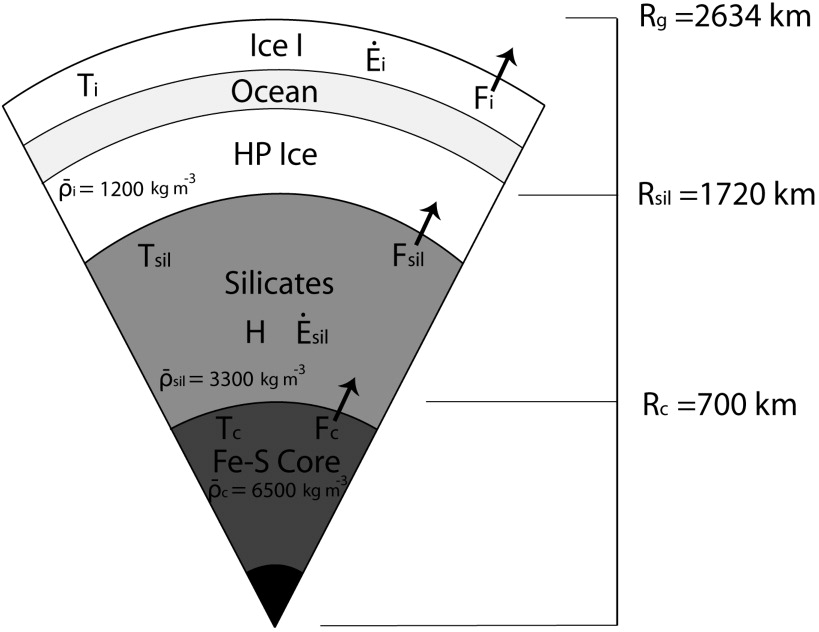

# Assignment 2

Alrighty, so we gotta try to modify the input.inp file to best suit our case for Ganymede. Ofc we can't really model the ocean layer though, so we'll just assume it's some solid mantle. We used [this paper](https://www.sciencedirect.com/science/article/pii/S0019103508004132) in Assignment 1, which has a model for a three-layer Ganymede.

So for example, and in the image above, we could combine Ice 1 and Ocean as a single layer. But then specify the first half of it to be of higher density and the second half slightly lower. We can do similar for the silicate layer and core.